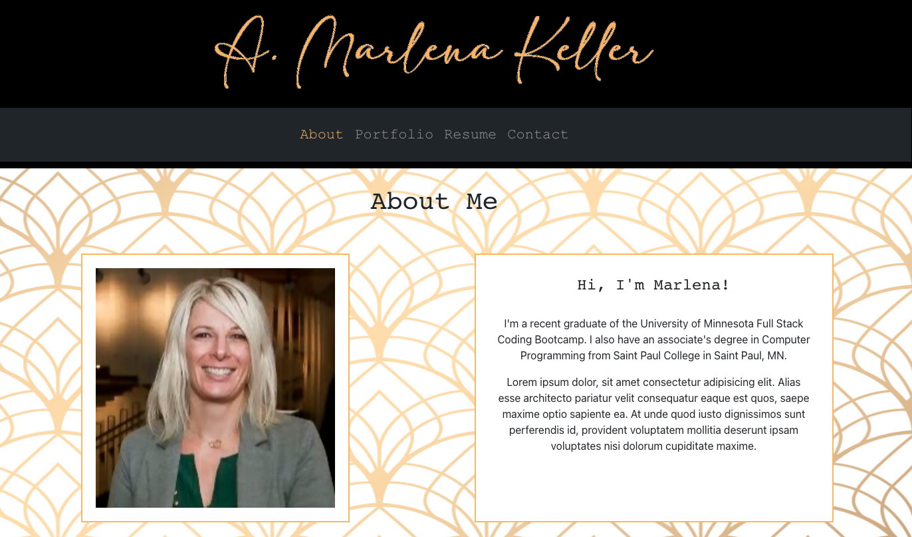

# A Portfolio Built Using React and React Bootstrap

## OBjective

The purpose of this project was to create a responsive, professional portfolio web app using React. The portfolio showcases some of my work, and links to my professional profiles including my GitHub and LinkedIn profiles. 

* Please note that this is deployed to Heroku and not GitHub pages because I have an existing GitHub pages account I didn't want to modify.

## Deployed App

## Screenshot

### Image Attribution

- [x] Background image from Freepik.com.
  [www.freepik.com/free-vector/gradient-art-deco-pattern-design_14571380.htm#query=art%20deco%20background&position=14&from_view=keyword&track=ais](www.freepik.com/free-vector/gradient-art-deco-pattern-design_14571380.htm#query=art%20deco%20background&position=14&from_view=keyword&track=ais)

- [x] Icon images from Flaticon.com.
  LinkedIn and GitHub icons created by riajulislam. Stack Overflow icon created by Xinh Studio.
  [www.flaticon.com/free-icons](www.flaticon.com/free-icons)

        